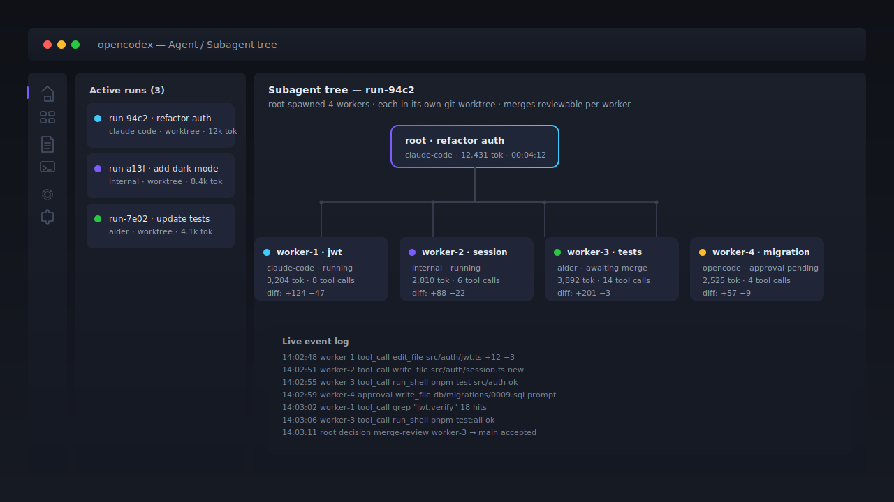

# OpenCodex

### Mission Control for AI coding agents. Any LLM. Your machine. Yours.



> The hero asset above is a hand-drawn SVG placeholder. The shipped artwork is a real screenshot of the AgentRunDrawer subagent tree view — see [PLACEHOLDERS.md](./PLACEHOLDERS.md) for the replacement spec.

OpenCodex is a **standalone desktop app that lives next to your editor and drives Claude Code, Aider, OpenCode, and a built-in agent as runners — over any LLM you point it at.** It runs locally on macOS, Windows, and Linux, unifies approvals, diffs, audit logs, and merge review across every runner you wire up, and never asks you to pick a single vendor.

**MIT licensed. Local-first. Provider-agnostic by contract. Plugin-extensible. Built to ship.**

> Stop juggling terminals. Start shipping.

---

## The pitch in five seconds

Your AI coding agents currently live in your terminal. Each one has its own CLI, its own approval model, its own log file, its own opinion about your repo. Switching between them is friction. Trusting them blindly is risk. Running them in parallel? Forget it.

**OpenCodex puts a roof over all of it.**

- One **UI** that drives every agent you already use
- One **approval system** that gates every tool call before it touches your repo
- One **signed audit log** (Ed25519) so you can prove what happened
- One **graphical diff review** that beats `git diff` on its best day
- **Any** LLM you want. Switch mid-conversation if the vibes are off.

---

## What's in the box

|                               |                                                                                                             |
| ----------------------------- | ----------------------------------------------------------------------------------------------------------- |
| **Built-in coding agent**     | Reads, edits, and runs code in your repo with per-tool approval gates                                       |
| **Chat with your codebase**   | AST-aware RAG (tree-sitter + hybrid vector/keyword search). The model actually knows what's in your project |
| **Multi-agent orchestration** | Fan out subtasks to parallel workers — each with its own model, scope, and git worktree                     |
| **Pluggable runners**         | Built-in, Claude Code, OpenCode, Aider — or ship your own via a plugin                                      |
| **Any LLM**                   | OpenAI, Anthropic, Google Gemini, xAI Grok, Mistral, Ollama (local), OpenRouter. Add more via plugins       |
| **MCP native**                | Every Model Context Protocol server becomes a tool/resource source automatically                            |
| **First-class plugin SDK**    | Tools, providers, runners, UI panels. Third-party on day one                                                |
| **Cross-platform**            | macOS, Windows, Linux — one codebase, one experience                                                        |
| **Local-first**               | No backend service. Keys live in your OS keychain. Your code never leaves your machine                      |

---

## Why OpenCodex vs the rest

**Aider** is brilliant in a terminal. Editor-bound. Python-centric.
**Claude Code** is polished. Anthropic-only.
**OpenCodex** is provider-agnostic by design, plugin-extensible from the first commit, and ships as a real desktop app with graphical diff review, signed audit logs, and an approval queue you can actually trust.

Love Aider? Love Claude Code? **OpenCodex drives them as runners.** It does not compete. It composes.

---

## Switch providers like you switch fonts

Every other coding agent picks a side. **OpenCodex picks the contract.** One `LLMProvider` interface in `packages/core` — every adapter implements it, every model declares its own capabilities, the UI gates features on those declarations. The result:

- **Eight adapters in the box** — OpenAI, Anthropic, Google Gemini, xAI Grok, Mistral, Ollama (local), OpenRouter, Voyage (embed-only) — plus any provider a plugin adds.
- **Switch mid-conversation.** The model picker groups by provider, shows capability badges (`tools` / `vision` / `cache` / `stream`) and cost per million tokens inline. Recent picks are pinned at the top.
- **No provider-specific code escapes its package.** The agent loop, the tool layer, the UI — none of them know the name of a single vendor. That's the whole point.
- **Bring your own.** A new provider is one package and one `LLMProvider` implementation. Ship it as a plugin, or upstream it.

This isn't just a feature. It's the architectural commitment that makes everything else portable.

---

## Sixty seconds to your first agent

```sh
pnpm install
pnpm dev
```

That's it. The [QUICKSTART](./QUICKSTART.md) walks you the rest of the way in under ten minutes — installer to first chat to first multi-agent run.

---

## The good parts

- **[User Manual](./MANUAL.md)** — every screen, every shortcut, every workflow. Read this first.
- **[Architecture](./docs/architecture.md)** — Electron + pnpm workspaces + the `LLMProvider` contract that keeps providers swappable forever.
- **[Roadmap](./Todo.md)** — master backlog. Watch us ship.
- **[Handoff Protocol](./HANDOFF.md)** — how multi-session agent work picks up where it left off without losing context.

---

## What it looks like under the hood

```
apps/
  desktop/                 Electron app (main / preload / renderer)
packages/
  core/                    LLMProvider, Tool, ChatEvent — the contracts
  provider-openai/         OpenAI Chat Completions + Responses
  provider-anthropic/      Anthropic Messages API
  provider-google/         Google Gemini
  provider-xai/            xAI Grok (OpenAI-compatible)
  provider-mistral/        Mistral chat + embeddings
  provider-ollama/         Local Ollama HTTP
  provider-openrouter/     OpenRouter unified API
  provider-voyage/         Voyage embeddings (embed-only)
  tools/                   Built-in tools (read_file, run_shell, grep, ...)
  plugin-sdk/              Public SDK for third-party plugin authors
  mcp-client/              Model Context Protocol client (stdio / SSE / HTTP)
  memory-local-fs/         Local markdown notes backend
  memory-obsidian/         Obsidian vault backend
  memory-notion/           Notion workspace backend
  memory-utils/            Shared helpers for memory backends
  runner-claude-code/      Claude Code CLI adapter
  runner-opencode/         OpenCode CLI adapter
  runner-aider/            Aider CLI adapter
  rag-chunker/             Tree-sitter chunker
  audit-verify/            Ed25519 audit-log verification CLI
  telemetry/               Opt-in PostHog telemetry shim
  crash-reporting/         Opt-in Sentry crash reporting shim
examples/
  plugins/                 Reference plugins for SDK consumers
docs/
```

Every LLM goes behind one interface. Every tool, every runner, every memory backend is swappable. No part of OpenCodex knows the name of a specific provider — and that's a feature.

---

## Dev setup

Node 20+, pnpm 9+. Then:

```sh
pnpm install
pnpm dev          # apps/desktop in dev mode
pnpm typecheck    # strict TS across all packages
pnpm build        # builds everything
pnpm test         # vitest across all packages
```

Before cutting a tag, the `release-readiness.yml` workflow gates on `pnpm check-placeholders` — every pre-tag sentinel in the tree (GitHub org/repo, security contact, etc.) must be resolved before release. See [PLACEHOLDERS.md](./PLACEHOLDERS.md) for the literal patterns and the per-file checklist.

---

## The principles

1. **Local-first, always.** No hosted backend. Your repo, your keys, your machine.
2. **Provider-agnostic by contract.** One `LLMProvider` interface. No provider-specific code outside its package.
3. **Plugins are first-class.** Tools, providers, runners, UI panels — all contributable.
4. **Approvals before actions.** Nothing touches your repo without you saying yes.
5. **Composable, not competitive.** If a great CLI exists, we drive it. We don't reinvent it.

---

## Status

Pre-v0.1, sprinting. See [Todo.md](./Todo.md) for the master backlog and [HANDOFF.md](./HANDOFF.md) for current session state. Things move fast. Stars and feedback wildly appreciated.

---

## Contributing

`/pickup` and `/handoff` agent protocols documented in [CLAUDE.md](./CLAUDE.md). Humans and agents alike are welcome — open a PR or follow the Todo.md/HANDOFF.md flow.

---

## License

[MIT](./LICENSE). Because your tools should belong to you.

---

**OpenCodex** — your code. Your keys. Your agents. All in one place.
